## Title 
Eco-fly

## Technology used for build
React.js
Node.js
MongoDB
Css
Express.js
Cors.js
## About
This web application was designed for Ecofly - travel agency .
 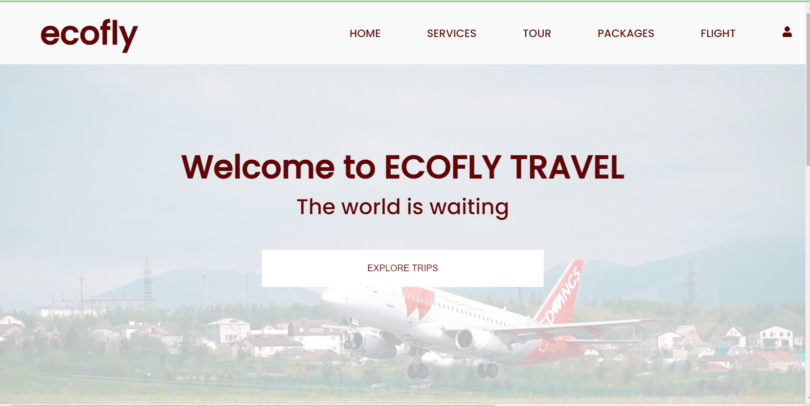

## Description
The frontend was built with ReactJs a javacsript library for building user interfaces , and was styled with CSS- Cascading SytleSheet .

The component (in the src folder) folder contains all the components that forms the application . Files with the extention jsx are the reactjs files while the corresponding files with the extension .module.css are the stylesheets. The files are named according to their functions, the Home.jsx file applies to the home page, services.jsx file applies to the services page, login.jsx file applies to the login page and so on . the router.jsx file is in charge of the routing from one point to another in the application.

The images folder contains all the images used in the application

The other files in the src folder were automatically created by the create-react-app package, each with it's own function 

The package-lock.json and package.json contains the apllication dependencies and important informations.

The gitignore file contains files and folders tat should be ignored when an attempt is made to push the project to github.

The node_modules folder contains all node packages installed with the command npm install.

The backend was built with nodejs and expres js . It was connected to the frontend using Axios - to fetch and send data to the backend

The auth.js file deals with user authentication using jwt- jsonwebtoken
The routes.js file deals with the routing and requests made from the frontend
The User.js file conrains the user schema - which provides a layout for the type of  user information that can be stored in the database
The database used was MONGODB 

## Pages
### HomePage
The home page is contained in the home.jsx component.
   __Features__
   A repeated background video of a plane taking off
      
   Pictures of top destinations that a user can visit and explore
      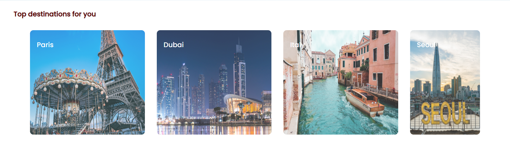

 ### Services Page
The services.jsx file contains the services page
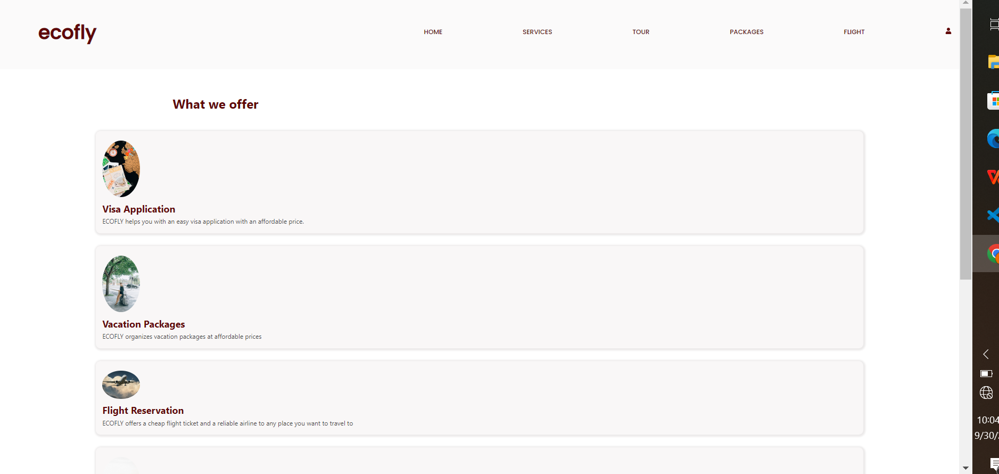
__Features__
List of the services rendered by ECOFLY - when clicked , each leads to another page showing more information about the clicked service
The services page dropdown menu has 3 options , each linking to a react component and a page
- ***Flight***
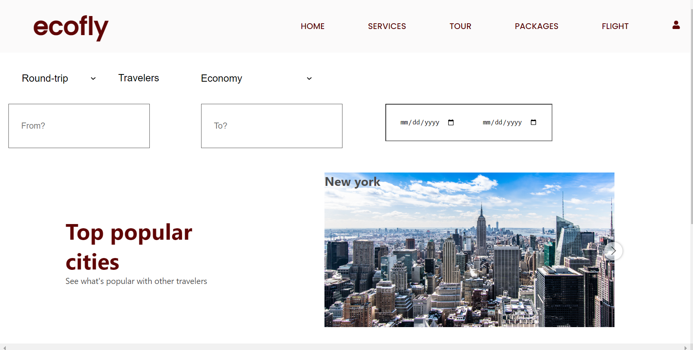
- ***Hotels***
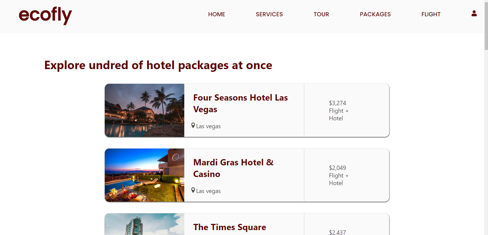
- ***Visa***
   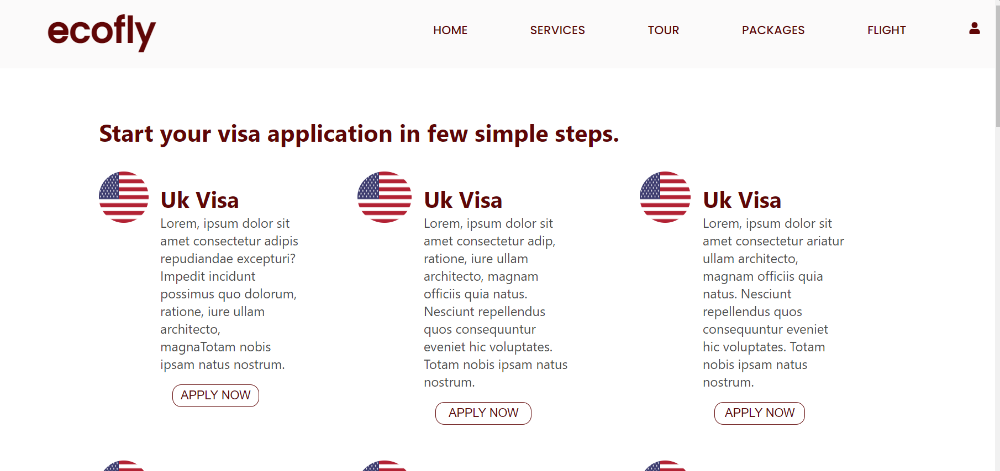

### Tour Page
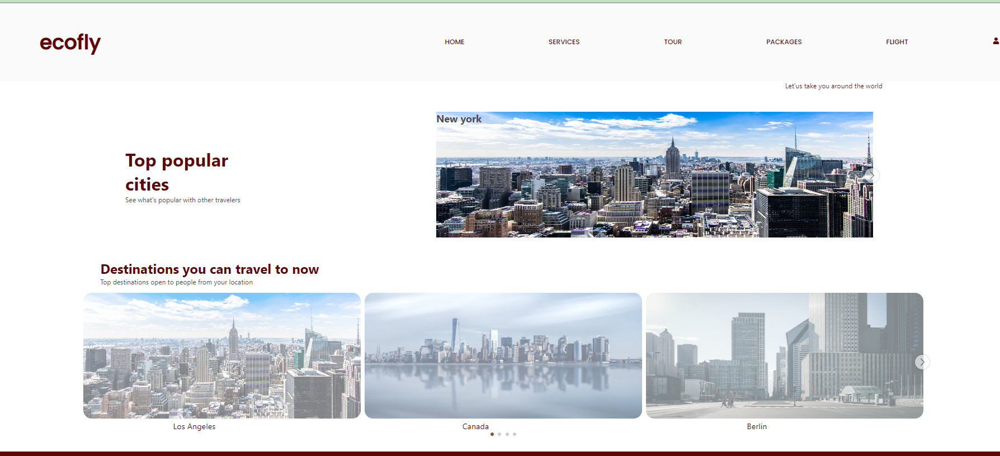
__Features__
An image slider (made with react-grid-carousel) which show popular destinations.
A second image slider which suggests top destinations that can be travelled to.

The tour page dropdown menu has 4 options , each linking to a react component and a page
- ***Popular Destinations***
   
- ***Cities***
   
- ***Offers***
   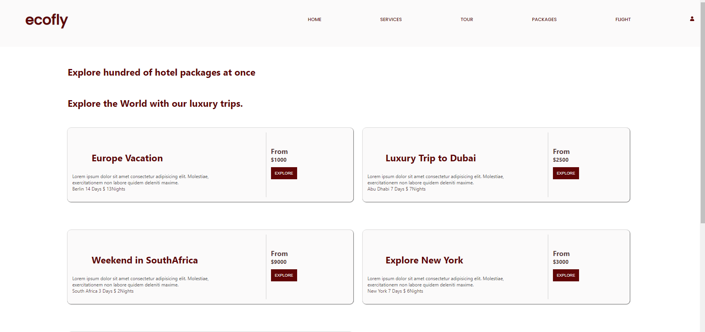
- ***Packages***
   

### Packages Page
__Features__

A link to hotel packages
A list of the available luxury trip packages
The packages page dropdown menu has 6 options , each linking to a react component and a page
- ***Private Tours***
   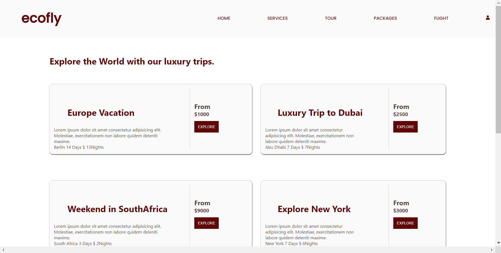
- ***Family Vacation***
   
- ***Baecation***
   
- ***Weekend Trips***
   
- ***Excursion***
   
- ***Hotels***
   

### Flight Page

__Features__
   Flights can be booked with form providing location autocomplete aid
### Visa page

__Features__
Shows a list of available visa and provides a platform to apply
### Login and register Page
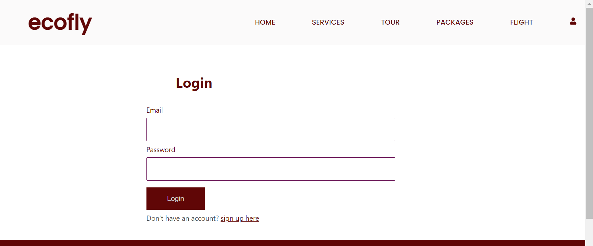 
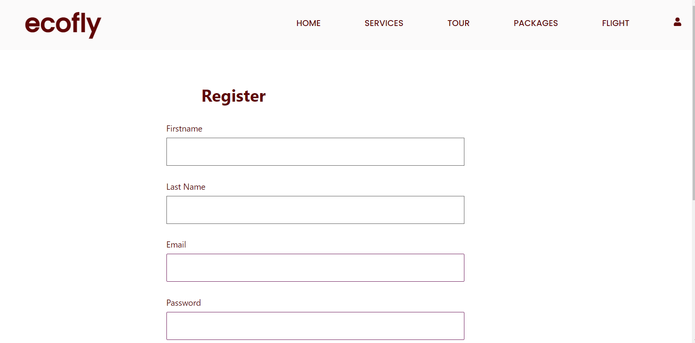
__Features__
   Login and register page allows existing users to login and new users to create an account
   Unless they are authenticated i.e logged in , user wont be able to access their account.

 
## Peaks
The application was designed with the users in mind . It is easy to understand and walkthrough.
It suggests places users can travel to based on their location, Users can explore hundreds of hotel packages, can also apply for their visa.
It is also secure,ensuring users can't get access to their profile unless they are logged in
Hotel , Car and Flight reservations can be made , The application also has a feature that provides autocomplete  when a user tries to enter a location thus making reservation easier.